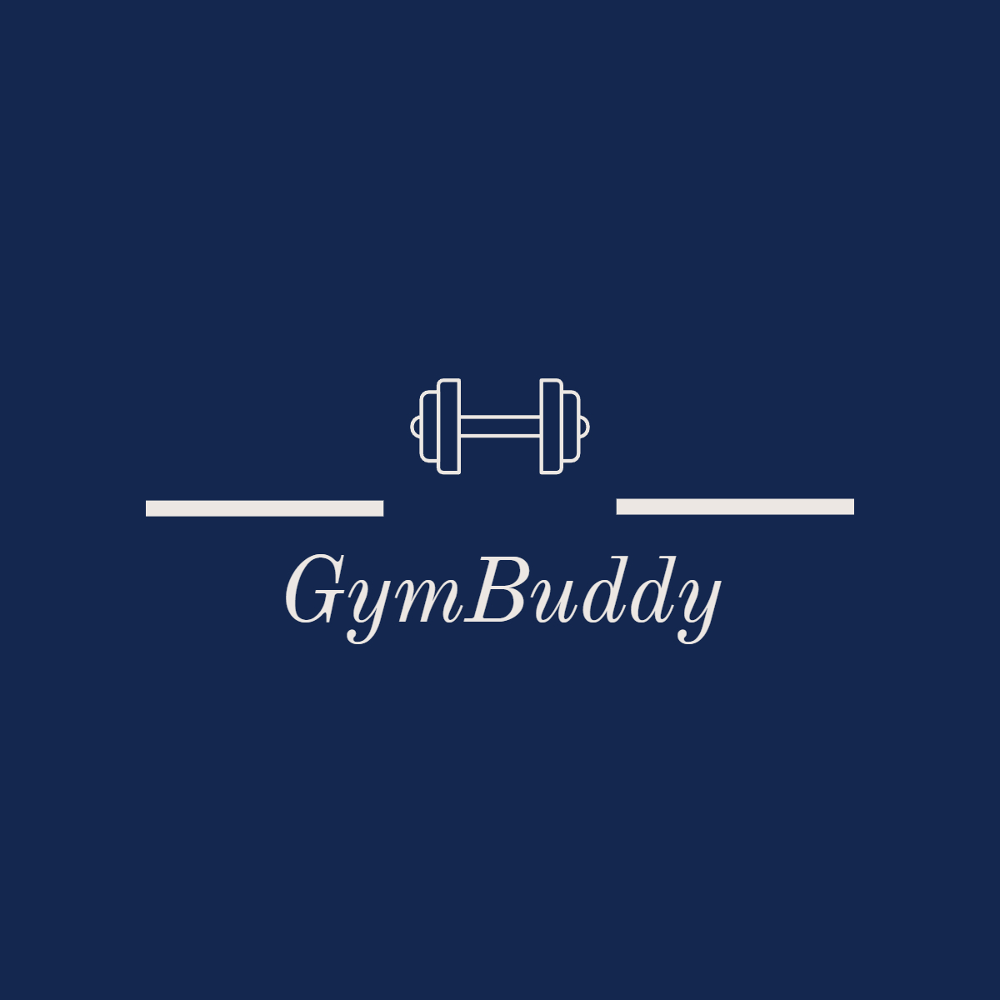
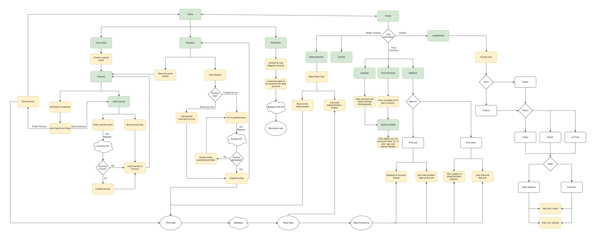

<!-- Improved compatibility of back to top link: See: https://github.com/othneildrew/Best-README-Template/pull/73 -->

<!--
*** Thanks for checking out the Best-README-Template. If you have a suggestion
*** that would make this better, please fork the repo and create a pull request
*** or simply open an issue with the tag "enhancement".
*** Don't forget to give the project a star!
*** Thanks again! Now go create something AMAZING! :D
-->

<!-- PROJECT SHIELDS -->
<!--
*** I'm using markdown "reference style" links for readability.
*** Reference links are enclosed in brackets [ ] instead of parentheses ( ).
*** See the bottom of this document for the declaration of the reference variables
*** for contributors-url, forks-url, etc. This is an optional, concise syntax you may use.
*** https://www.markdownguide.org/basic-syntax/#reference-style-links
-->
[![Contributors][contributors-shield]][contributors-url]
[![Forks][forks-shield]][forks-url]
[![Stargazers][stars-shield]][stars-url]
[![Issues][issues-shield]][issues-url]
[![MIT License][license-shield]][license-url]
[![LinkedIn][linkedin-shield]][linkedin-url]

<!-- PROJECT LOGO -->
 

  

<h3 align="center">GymBuddy</h3>

  

    Transforming Fitness, One Buddy at a Time
     
    <a href="https://github.com/github_username/repo_name"><strong>Explore the docs »</strong></a>
     
     
    <a href="https://github.com/github_username/repo_name">View Demo</a>
    ·
    <a href="https://github.com/github_username/repo_name/issues">Report Bug</a>
    ·
    <a href="https://github.com/github_username/repo_name/issues">Request Feature</a>
  

<!-- TABLE OF CONTENTS -->
## Table of Contents
- [About The Project](#about-the-project)
  - [Motivation](#motivation)
  - [Objectives](#objectives)
- [User Stories](#user-stories)
- [Features](#features)
  - [Workout Tracker](#workout-tracker)
  - [Workout Routines](#workout-routines)
  - [Workout Analysis](#workout-analysis)
  - [Weight & Calorie Tracker](#weight--calorie-tracker)
  - [Social Features](#social-features)
- [Design](#design)
  - [Software Architecture](#software-architecture)
  - [Workflow](#workflow)
  - [Entity-Relationship Diagram](#entity-relationship-diagram)
- [Timeline](#timeline)
  - [Milestone 1 - Ideation (Completed)](#milestone-1---ideation-29-may)
  - [Milestone 1 - Ideation (Completed)](#milestone-1---ideation-29-may)
  - [Milestone 2 - Prototype ](#miletsone)
  - [Tech Stack](#tech-stack)

<!-- ABOUT THE PROJECT -->
## Team Gym Connoisseurs

Team Members: Ho Kin Tat, Tan Si Rui

Proposed Level of Achievement: Apollo 11

(<a href="#readme-top">back to top</a>)

## About The Project

### Motivation
As fitness enthusiasts, we've always found tracking our workouts crucial in making consistent progress. It's not just about tracking duration or intensity; it's about seeing advancements in specific exercises and adjusting routines for optimal training. It keeps us accountable, gives a clear measure of our progress, and motivates us to push our limits. However, the challenge we've often encountered is the lack of convenience and personalization in existing workout apps.

Drawing from our personal experiences and a desire to help others on their fitness journey, we envision an app that offers more than just workout tracking. Imagine an app that not only logs your fitness progress but also provides you with personalized workout routines tailored to your unique characteristics such as height, weight, and body type. Think of it as your personal trainer, guiding you step-by-step and helping you make sense of the vast world of fitness.

But we also understand that motivation can sometimes be hard to sustain. That's where a sense of community and friendly competition come in. Our app features a leaderboard system, promoting a healthy competitive spirit among users. It adds a fun element to the fitness journey, encouraging you to keep pushing and making each personal best feel even more rewarding.

Ultimately, we're excited to bring to life an app that transforms fitness tracking into a more personal, engaging, and rewarding experience. It's not just about keeping logs; it's about embarking on a fitness journey that is uniquely yours, supported by a community that cheers you on every step of the way.

### Objectives

We are developing a holistic mobile application that goes beyond tracking workouts, offering a comprehensive health companion. Our app will track various health-related metrics, provide personalized recommendations, and incorporate leaderboards for healthy competition and motivation. By empowering users to optimize their fitness routines and align their nutrition with their goals, our goal is to provide a dynamic and engaging platform that supports users every step of the way on their fitness journey.

## User Stories

1. As an individual who exercises regularly, I would like to log my workouts as well as track my weight and calories using the same application

2. As an individual who wishes to improve on exercise forms, I would like a tutorial video on how to properly perform an exercise

3. As an individual who just started to work out, I want to know what workouts I can do with my current resources and how to execute the exercises in a safe manner as a beginner

4. As an individual with a fitness goal, I would like to be able to view charts and data from past workouts to make sure that I am progressing towards my goals.

5. As an individual who just started to gym, I have encountered machines in the gym that I am unsure of how to use. I would like to have guidance and learn how to properly use such machines.

6. As an individual, I would like to feel accomplished whenever I have completed every workout. I would also like to be able to view my friends’ progress in the gym.

## Features

### Workout Tracker

| Subfeature        | Description                                                                                                                                            |
|-------------------|--------------------------------------------------------------------------------------------------------------------------------------------------------|
| Workout Tracker   | Users will have the option to start a new workout, which they will then be prompted to select the type of exercise they will be engaging in, from cardiovascular activities such as running to weightlifting and calisthenics from an existing database of exercises. |
| Timer             | Users are able to set a timer within the application to time their workouts without changing applications.                                              |

### Workout Routines

| Subfeature              | Description                                                                                                                    |
|-------------------------|--------------------------------------------------------------------------------------------------------------------------------|
| Custom Exercise Routines | Users can create their own personal exercise routines by adding different workouts to a routine. This will help to organize their workouts, which they can easily follow during their training. |
| Workout Recommendations | Users can view a set of exercises based on the specific muscle groups they are interested in working out for the session. The recommended exercises will include a short description of how to execute the exercise and explain which muscle groups are targeted in the movement. |

### Workout Analysis

| Subfeature           | Description                                                                                                                                                                                                                     |
|----------------------|---------------------------------------------------------------------------------------------------------------------------------------------------------------------------------------------------------------------------------|
| View Past Workouts   | Users will be able to view specific information about their past workouts, such as the number of reps and sets done for each exercise. Users can also view charts about their progress over time, which displays information such as their total volume and best sets for a specific exercise. |
| Weight Recommendations & Projections | Run data through a machine learning model to predict/recommend a weight for the user to use for their exercise.                                                                                                                                                          |

### Weight & Calorie Tracker

| Subfeature                | Description                                                                                                                               |
|---------------------------|-------------------------------------------------------------------------------------------------------------------------------------------|
| Weight & Calorie Tracker  | Users can use the app to track their weight by using the weight tracker function. Calorie recommendations and tracking will also be implemented, to help users reach their targeted weight range. |

### Social Features

| Subfeature      | Description                                                                                                                                                                                                                                     |
|-----------------|-------------------------------------------------------------------------------------------------------------------------------------------------------------------------------------------------------------------------------------------------|
| Levels System   | Users can create their own personal exercise routines by adding different workouts to a routine. This will help to organize their workouts, which they can easily follow during their training.                                               |
| Leaderboard     | Users can view a set of exercises based on the specific muscle groups they are interested in working out for the session. The recommended exercises will include a short description of how to execute the exercise and explain which muscle groups are targeted in the movement. |

See the [open issues](https://github.com/github_username/repo_name/issues) for a full list of proposed features (and known issues).

## Design

### Software Architecture
&nbsp;

  
   
  <em>Software Architecture </em>

### Workflow
&nbsp;

  
   
  <em>Overall Workflow</em>

&nbsp;

  
   
  <em>Authentication Flow</em>

### Entity-Relationship Diagram
&nbsp;

  
   
  <em>ER Diagram</em>

## Project Management

## Testing

## Timeline

### Milestone 1 - Ideation (29 May)
| Task                          | Description                                | Handled By                          | Complete By     |                                                                                                                                                   
|-------------------------------|--------------------------------------------|-------------------------------------|---------------------------------------------------------------------------------------------------------------------------------------------------------|
| System Design | Planned a workable system and workflow | Si Rui,          Kin Tat | 17 May |                                        
| Familiarisation | Completed courses on React Native, Firebase etc.     | Si Rui,           Kin Tat            | 22 May  | 
| Familiarise with React Native | Researched on optimal ways to implement React Native | Kin Tat  | 22 May                          |
| Familiarise with Firebase | Researched on optimal ways to implement Firebase | Si Rui | 22 May | 
| Creating of User Interfaces | Implemented the basic screens of any mobile app (Login,  Sign Up, Home, etc.) | Kin Tat | 25 May           | | User authentication | Integrated app with Firebase authentication | Si Rui | 26 May |  
| UX Improvements | Improved the logic and the general flow of the app | Si Rui,           Kin Tat | 28 May |                                      

#### Milestone 1- Poster Submission

#### Milestone 1 - Project Log

- [Project Log](https://docs.google.com/spreadsheets/d/1yHligF582YADPFCzW3yTwsqdrYlV3PO84IVQieO3TVw/edit?usp=sharing)

#### Milestone 1 - Project Video 
                                       
Prototype Demo - Showcase of User Authentication and Quick Start Feature
                                       

### Milestone 2 - Prototype (26 June)
| Task                          | Description                                | Handled By                          | Complete By     |                                                                                                                                                   
|-------------------------------|--------------------------------------------|-------------------------------------|---------------------------------------------------------------------------------------------------------------------------------------------------------|
| Setting up of database | Integrated app with FireStore NoSQL database | Si Rui | 4 June |  
| API Implementation | Implemented Exercise API and OpenAI API | Si Rui,          Kin Tat | 10 June |                                        
| Workout Tracker | Implementation of key feature     | Kin Tat            | 12 June  | 
| Recommended Routine | Implementation of key feature | Si Rui  | 15 June                          |
| Weight and Calorie tracker | Implementation of key feature | Si Rui | 22 June | 
| Leaderboard  | Implementation of key feature | Kin Tat | 23 June           | 
| UX Improvements | Improved the logic and aesthetic of the app | Si Rui,           Kin Tat | 26 June |          

#### Milestone 2 - Poster Submission

#### Milestone 2 - Project Video 

## Tech Stack

  

(<a href="#readme-top">back to top</a>)

<!-- MARKDOWN LINKS & IMAGES -->
<!-- https://www.markdownguide.org/basic-syntax/#reference-style-links -->
[contributors-shield]: https://img.shields.io/github/contributors/github_username/repo_name.svg?style=for-the-badge
[contributors-url]: https://github.com/github_username/repo_name/graphs/contributors
[forks-shield]: https://img.shields.io/github/forks/github_username/repo_name.svg?style=for-the-badge
[forks-url]: https://github.com/github_username/repo_name/network/members
[stars-shield]: https://img.shields.io/github/stars/github_username/repo_name.svg?style=for-the-badge
[stars-url]: https://github.com/github_username/repo_name/stargazers
[issues-shield]: https://img.shields.io/github/issues/github_username/repo_name.svg?style=for-the-badge
[issues-url]: https://github.com/github_username/repo_name/issues
[license-shield]: https://img.shields.io/github/license/github_username/repo_name.svg?style=for-the-badge
[license-url]: https://github.com/github_username/repo_name/blob/master/LICENSE.txt
[linkedin-shield]: https://img.shields.io/badge/-LinkedIn-black.svg?style=for-the-badge&logo=linkedin&colorB=555
[linkedin-url]: https://linkedin.com/in/linkedin_username
[product-screenshot]: images/screenshot.png
[Next.js]: https://img.shields.io/badge/next.js-000000?style=for-the-badge&logo=nextdotjs&logoColor=white
[Next-url]: https://nextjs.org/
[React.js]: https://img.shields.io/badge/React-20232A?style=for-the-badge&logo=react&logoColor=61DAFB
[React-url]: https://reactjs.org/
[Vue.js]: https://img.shields.io/badge/Vue.js-35495E?style=for-the-badge&logo=vuedotjs&logoColor=4FC08D
[Vue-url]: https://vuejs.org/
[Angular.io]: https://img.shields.io/badge/Angular-DD0031?style=for-the-badge&logo=angular&logoColor=white
[Angular-url]: https://angular.io/
[Svelte.dev]: https://img.shields.io/badge/Svelte-4A4A55?style=for-the-badge&logo=svelte&logoColor=FF3E00
[Svelte-url]: https://svelte.dev/
[Laravel.com]: https://img.shields.io/badge/Laravel-FF2D20?style=for-the-badge&logo=laravel&logoColor=white
[Laravel-url]: https://laravel.com
[Bootstrap.com]: https://img.shields.io/badge/Bootstrap-563D7C?style=for-the-badge&logo=bootstrap&logoColor=white
[Bootstrap-url]: https://getbootstrap.com
[JQuery.com]: https://img.shields.io/badge/jQuery-0769AD?style=for-the-badge&logo=jquery&logoColor=white
[JQuery-url]: https://jquery.com 
